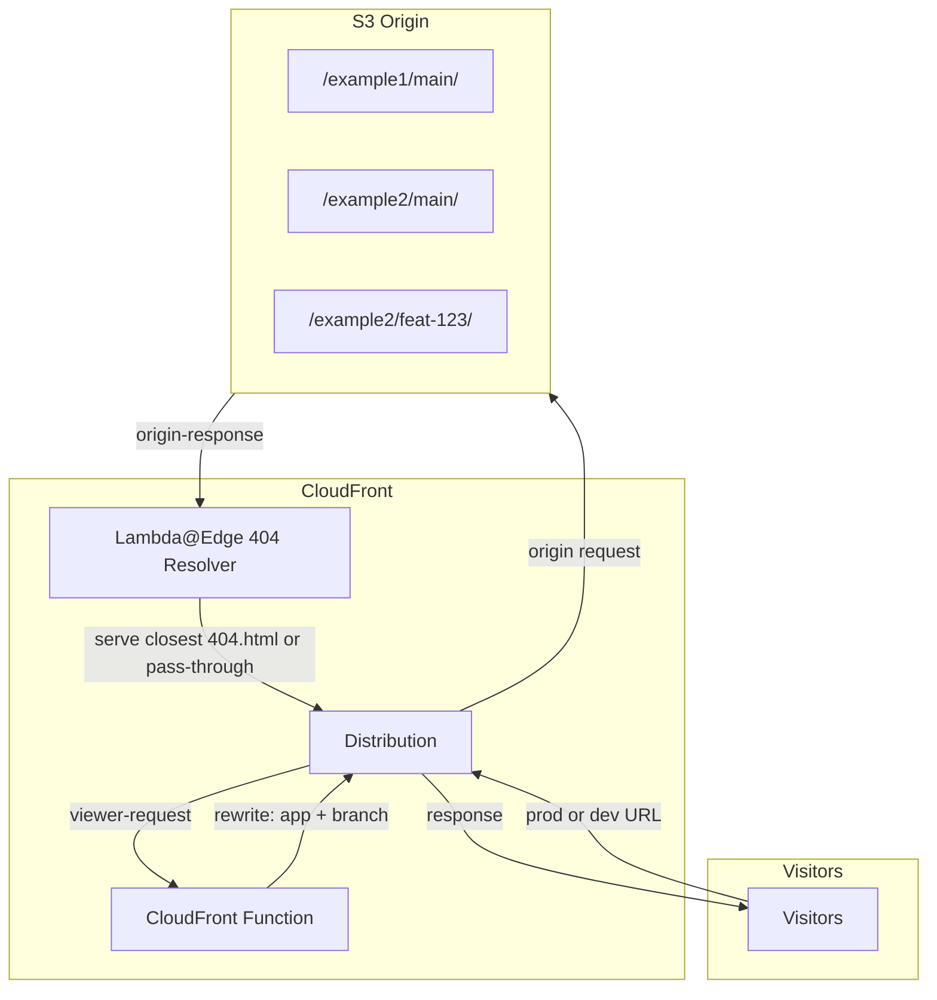

<!-- 8360e49e-2e0e-49af-834c-e4e1e39b4b9c -->
# Static Hosting with Dynamic Subdomain Routing - Implementation Plan

## Single Source of Truth

- Canonical planning document: `docs/SPEC.md` (this file).
- All planning updates must be made in this canonical file only to prevent drift.

## Purpose

A single-company platform for hosting multiple static apps with automatic branch previews. Each app lives in its own GitHub repository and deploys to a shared infrastructure (one S3 bucket, one CloudFront distribution). App repos integrate via a reusable GitHub Actions workflow that handles build, deploy, cache invalidation, and PR preview URL comments.

## Architecture Summary



**Key decision**: Use CloudFront Functions for subdomain URI rewriting, and use Lambda@Edge (origin-response) only for hierarchical 404 handling of HTML/navigation misses (closest branch/app/global 404 page). Non-HTML assets (`js`, `css`, images, fonts, etc.) keep plain origin/default `404` responses. Lambda@Edge remains optional for future basic auth.

**Important**: Do NOT configure CloudFront custom error responses on the distribution — they would conflict with the Lambda@Edge 404 resolver.

### Scalability

- S3 has no practical prefix limit — hundreds or thousands of apps work fine
- CloudFront: 1,000 free invalidation paths/month, then $0.005/path — budget consideration for frequent deploys across many apps
- Single distribution handles all apps (CloudFront has no origin-path-count limit)

---

## URL Structure and S3 Directory Layout

### URL Patterns

| URL Pattern | S3 Path | Use Case |
|-------------|--------|----------|
| `{app}.{baseDomain}` | `/{app}/{mainBranchName}/` | Production (simple subdomain -> main branch content) |
| `{app}--{branch}.dev.{baseDomain}` | `/{app}/{branch}/` | Dev (flat subdomain only — single label with `--` separator for wildcard DNS/cert) |

Production uses simple `{app}.{baseDomain}` and always resolves to `{mainBranchName}` (default `main`). Dev uses flat subdomains (`{app}--{branch}`) so the dev host is a single label, enabling `*.dev.{baseDomain}` wildcard and ACM cert; parsed branch resolves to `/{app}/{branch}/`.

**Examples** (base domain `demo.oleksiipopov.com`):

| URL | S3 Path |
|-----|---------|
| `example1.demo.oleksiipopov.com` | `/example1/<main-branch-name>/index.html` |
| `example1.demo.oleksiipopov.com/assets/logo.png` | `/example1/<main-branch-name=main>/assets/logo.png` |
| `example1--feat-new-ui.dev.demo.oleksiipopov.com` | `/example1/feat-new-ui/index.html` |
| `example2--main.dev.demo.oleksiipopov.com/` | `/example2/<main-branch-name=main>/index.html` |

### S3 Directory Structure

```
/
├── {app}/
│   ├── 404.html                  # App-level fallback page
│   ├── {mainBranchName}/         # Production content (default: main)
│   │   ├── index.html
│   │   ├── 404.html              # Branch-level fallback page
│   │   ├── assets/
│   │   │   └── ...
│   │   └── ...
│   ├── {branch-a}/               # Branch preview (e.g. feat-new-ui)
│   │   ├── index.html
│   │   ├── 404.html
│   │   └── ...
│   └── {branch-b}/
│       └── ...
└── 404.html                      # Optional global fallback page
```

### Closest 404 Resolution

For missing objects, serve the closest 404 page inline for HTML/navigation requests only. Non-HTML resource misses return a regular `404` without intervention:

1. Resolve `app` and `branch` from subdomain (prod uses `{mainBranchName}`, dev uses parsed `{branch}` from `{app}--{branch}`).
2. Detect request type:
   - Treat as HTML/navigation if URI has no file extension, or ends with `.html`, or `Accept` contains `text/html`.
   - Otherwise (e.g. `.js`, `.css`, `.png`, `.svg`, fonts, source maps), return original `404/403` as-is.
3. Build candidate paths in order:
   - `/{app}/{branch}/404.html` (branch-level)
   - `/{app}/404.html` (app-level)
   - `/404.html` (global fallback, optional but recommended)
4. Check candidate existence in S3 (`HeadObject`).
5. Fetch the first existing candidate (`GetObject`) and return its body inline as the Lambda@Edge generated response with **status `404`** and `Content-Type: text/html`. This avoids a redirect (no URL change, no extra round trip, no SEO issues). Lambda@Edge generated response body limit is 1 MB — sufficient for error pages. If no candidate exists, return the original `404/403`.

**SPA fallback**: For single-page apps with client-side routing, apps should use their branch-level `404.html` as the SPA entry point (same content as `index.html`). The closest-404 resolver will serve it for any unmatched HTML path, preserving the original URL.

### Client-Side Routing Modes

The platform supports all common routing strategies without per-app configuration:

- **Static / MPA** — works naturally; each page is a real file in S3
- **Hash routing** (`/#/path`) — works out of the box; the hash fragment is never sent to the server, so S3 always serves `index.html`
- **History / browser routing (SPA)** — deploy `404.html` with the same content as `index.html`; the closest-404 resolver serves it inline for any unmatched path, preserving the URL for the client-side router to handle

### Safe Branch and App Names

**Branch name** (used in dev subdomain and S3 path):

- **Character set**: `[a-z0-9-]` (lowercase alphanumeric, hyphens only)
- **Length**: 1–63 characters (DNS label limit)
- **Pattern**: No leading/trailing hyphen; must not contain `--` (reserved as app--branch separator)
- **Regex**: `^[a-z0-9]([a-z0-9-]{0,61}[a-z0-9])?$` and `!name.includes('--')`
- **Sanitization**: Git branch names are sanitized before use — lowercase, replace any run of unsupported characters (`/`, `_`, `.`, etc.) with a single `-`, strip leading/trailing `-`, truncate to 63 chars. Examples: `feature/login` → `feature-login`, `Feature/New__UI` → `feature-new-ui`, `fix/bug...#123` → `fix-bug-123`. The deploy workflow applies this automatically; the validation regex runs after sanitization

**App slug** (used in subdomain and S3 prefix):

- Same rules as branch: `^[a-z0-9]([a-z0-9-]{0,61}[a-z0-9])?$` and `!slug.includes('--')`
- Must be validated at deploy time (CI) and in CloudFront Function (defensive)

**Validation module**: `packages/infra/src/lib/validation.ts` — export `validateBranchName()`, `validateAppSlug()`; throw on invalid input.

---

## CloudFront Caching

**Implemented in** `SubdomainRoutingDistribution`:

- **Default behavior** (navigation, HTML, and extensions without a dedicated behavior): custom `HtmlCachePolicy` — `defaultTtl: 300s`, `minTtl: 0`, `maxTtl: 300s`
- **Additional behaviors** (managed `CachingOptimized`): `*.js`, `*.css`, `*.png`, `*.jpg`, `*.svg`, `*.woff2` — each with the same viewer-request CloudFront Function
- **Not mirrored as separate behaviors**: other `FILE_REGEX` types (e.g. `.jpeg`, `.gif`, `.ico`, `.woff`, `.ttf`, `.eot`) use the default short-TTL behavior

**Origin `Cache-Control`** (browser caching):

- CDK bootstrap uploads (global `404.html`, demo apps) set `max-age=0, s-maxage=300` (or `s-maxage=10` for global 404) via `BucketDeployment`
- App-deployed content: set by each app's build output; there is **no** CloudFront response headers policy on the distribution today
- **Recommended for app builds**: HTML `max-age=0, s-maxage=300`; static assets `max-age=31536000, immutable`

**Error handling split**:

- HTML/navigation misses: closest-404 inline body served by Lambda@Edge
- Non-HTML misses: plain origin `404` response (no Lambda@Edge intervention)

**Not configured yet**: explicit low TTL for cached `403/404` at the edge (rely on invalidation after deploy)

**Invalidation**: `/{app}/{mainBranchName}/*` + `/{app}/404.html` (production) or `/{app}/{branch}/*` + `/{app}/404.html` (branch). Global fallback: `/404.html` separately when needed

---

## Invalidation GitHub Action

**Workflow**: `invalidate-app.yml`

- **Trigger**: `workflow_dispatch` with inputs:
  - `app` (required): App slug — validated against safe pattern
  - `branch` (optional): Branch name — if provided, invalidate `/{app}/{branch}/*` + `/{app}/404.html`; if omitted, invalidate `/{app}/{mainBranchName}/*` + `/{app}/404.html` (production)
  - `wait` (optional, default: false): Whether to poll until invalidation completes
- **Steps**:
  1. Validate `app` (and `branch` if provided) with shared validation
  2. Configure AWS credentials (OIDC)
  3. Create invalidation: `aws cloudfront create-invalidation --distribution-id $DIST_ID --paths "/{app}/{mainBranchName}/*" "/{app}/404.html"` or `--paths "/{app}/{branch}/*" "/{app}/404.html"`
  4. If `wait`: poll `get-invalidation` until status is `Completed` (with timeout)
- **Distribution ID**: Stored in SSM `/static-hosting/distribution-id` by HostingStack via `StringParameter`
- **Reusability**: Exposes `workflow_call` for manual or chained use. **`deploy-app.yml` inlines invalidation** (same path rules) rather than calling this workflow — avoids a nested workflow run

---

## Reusable Deploy Workflow

**Workflow**: `deploy-app.yml` — a reusable workflow (`workflow_call`) that app repositories consume to build, deploy, invalidate, and post preview URLs.

### Usage from app repo

```yaml
# In app repo: .github/workflows/deploy.yml
name: Deploy
on:
  push:
    branches: [main]
  pull_request:

jobs:
  deploy:
    uses: <org>/static-hosting-for-vibe-coders/.github/workflows/deploy-app.yml@main
    with:
      app-slug: my-app
      build-command: pnpm build
      output-dir: dist
      base-domain: demo.oleksiipopov.com
    secrets: inherit
```

### Inputs

| Input | Required | Default | Description |
|-------|----------|---------|-------------|
| `app-slug` | yes | — | App slug (validated against safe pattern) |
| `build-command` | no | `pnpm build` | Command to build the app |
| `output-dir` | no | `dist` | Directory containing build output |
| `branch` | no | derived | Branch for S3 prefix: input, else `github.head_ref` (PR), else `github.ref_name` |
| `base-domain` | no | `demo.oleksiipopov.com` | Base domain for preview URL comments |
| `main-branch` | no | `main` | Production branch folder name (used for prod invalidation paths on push to main) |
| `platform-repository` | no | `AlexeyPopovUA/static-hosting-for-vibe-coders` | Repo containing `validate-names.ts` |
| `platform-ref` | no | `main` | Git ref for platform checkout |

### Requirements

- App repos must use **pnpm** (`mise.toml` recommended so `jdx/mise-action` matches local tooling)
- App repo needs `AWS_AUTH_ROLE` and OIDC configured (same as platform)

### Steps

1. Checkout the calling app repo
2. Checkout platform repo into `.platform` (for validation scripts)
3. Setup toolchain via `jdx/mise-action` (from app repo `mise.toml`)
4. `pnpm install --frozen-lockfile` in app repo; same in `.platform` for script deps
5. Run `build-command`
6. Sanitize `branch` and validate `app-slug` via `.platform/packages/infra` → `validate-names.ts` (`--print-sanitized-branch`)
7. Configure AWS credentials (OIDC)
8. `aws s3 sync --delete {output-dir}/ s3://{bucket}/{app-slug}/{sanitized-branch}/`
9. Inline CloudFront invalidation (same paths as `invalidate-app.yml`; prod push to `main-branch` uses `/{app}/{main-branch}/*`)
10. If PR: post/update comment with preview URL via `peter-evans/create-or-update-comment@v5`

### PR Preview Comment

On pull request events, the workflow posts (or updates) a comment with the preview URL:

```
Preview: https://{app-slug}--{branch}.dev.demo.oleksiipopov.com
```

Uses `peter-evans/create-or-update-comment` or similar action. The comment is updated on subsequent pushes to the same PR.

### Secrets and Permissions

- `id-token: write` — for OIDC AWS authentication
- `contents: read` — to checkout the app repo
- `pull-requests: write` — to post preview URL comments
- Bucket name: read from SSM `/static-hosting/bucket-name` or passed as input
- Distribution ID: read from SSM `/static-hosting/distribution-id`

---

## Project Structure

```
static-hosting-for-vibe-coders/
├── mise.toml                         # node 24.x, pnpm 10.x
├── docs/
│   └── SPEC.md                       # Master specification (this file)
├── .cursor/skills/create-demo-app/   # Agent skill + scaffold script for new app repos
├── packages/
│   └── infra/
│       ├── assets/
│       │   ├── demo-apps/            # hello, palette — deployed by CDK on stack deploy
│       │   └── global-404/           # bucket-root /404.html
│       ├── src/
│       │   ├── bin/app.ts
│       │   ├── config.ts             # HOSTING_* env → stack props
│       │   ├── lib/
│       │   │   ├── constructs/
│       │   │   │   ├── static-hosting-bucket.ts
│       │   │   │   ├── subdomain-routing-distribution.ts
│       │   │   │   ├── subdomain-routing-function.ts
│       │   │   │   └── demo-apps-deployment.ts
│       │   │   ├── stacks/hosting-stack.ts
│       │   │   ├── validation.ts
│       │   │   ├── validation.test.ts
│       │   │   ├── dns.ts            # hosted-zone prefix helpers
│       │   │   └── dns.test.ts
│       │   ├── scripts/validate-names.ts
│       │   └── functions/
│       │       ├── subdomain-routing/
│       │       │   ├── index.js
│       │       │   └── subdomain-routing.test.ts
│       │       └── closest-404/index.ts
│       ├── cdk.json
│       ├── package.json
│       └── tsconfig.json             # types: ["node"] for TypeScript 6
├── .github/workflows/
│   ├── deploy-infra.yml
│   ├── validate-infra.yml
│   ├── deploy-app.yml
│   ├── cleanup-branch.yml
│   ├── cleanup-app.yml
│   └── invalidate-app.yml
├── package.json
├── pnpm-workspace.yaml
└── README.md
```

---

## Phase 1: Project Bootstrap and Specification

### 1.1 Create `docs/SPEC.md` (spec-driven development)

Document all aspects:
- **Architecture**: Diagram, components, data flow
- **URL structure**: Production (`{app}.{baseDomain}`), dev (`{app}--{branch}.dev.{baseDomain}`) — flat subdomains for dev only (wildcard DNS/cert)
- **S3 layout**: `/{app}/{mainBranchName}/` (prod), `/{app}/{branch}/` (branch preview)
- **404 handling**: For HTML/navigation requests, serve closest available 404 page inline (`/{app}/{branch}/404.html` -> `/{app}/404.html` -> `/404.html`); for non-HTML resources, return plain `404`
- **Validation**: Branch and app slug rules (regex, length 1–63)
- **Caching**: CloudFront cache policy (HTML vs static assets)
- **Invalidation**: Manual workflow for app/branch, optional wait
- **Tech stack**: Node.js 24, pnpm 10, TypeScript 6.x, AWS CDK 2.x, Vitest 4
- **Environments**: Dev/staging (optional), production
- **Configuration**: Domain, certificate, hosted zone (import or create)
- **Tagging**: `Project`, `Environment`, `ManagedBy` (CDK)
- **Security**: OAC for S3, no public bucket access
- **CI/CD**: GitHub Actions, OIDC, path triggers

### 1.2 Bootstrap project

- Root `package.json` with `engines`: `node: ">=24"`, `pnpm: ">=10"`
- `mise.toml`: `node 24.16.0`, `pnpm 10.34.1` (or latest)
- `pnpm-workspace.yaml`: `packages: ['packages/*']`
- `packages/infra/`: CDK app, `aws-cdk-lib` latest, `constructs` ^10

**Commit**: `chore: bootstrap project with mise, pnpm, and spec`

---

## Phase 2: CDK Constructs

### 2.1 `StaticHostingBucket` construct

- S3 bucket, block public access, Origin Access Control (OAC) for CloudFront
- Use `S3BucketOrigin.withOriginAccessControl()` (not legacy OAI)
- Optional `removalPolicy`, `bucketName` prefix
- Tags: `Project`, `Environment`
- **Output**: Write `bucketName` to SSM parameter `/static-hosting/bucket-name` (for deploy workflow)
- **Global 404**: `BucketDeployment` from `assets/global-404/` to bucket root `/404.html` (`max-age=0, s-maxage=10`)

### 2.2 `SubdomainRoutingFunction` construct

- CloudFront Function (not Lambda@Edge)
- Logic (ES5.1) — flat subdomain parsing for dev only:
  1. Parse `Host` header (e.g. `example1--feat-123.dev.demo.oleksiipopov.com` or `example1.demo.oleksiipopov.com`):
     - If host contains `.dev.`: extract first label, split on `--` → `app = parts[0]`, `branch = parts.slice(1).join("--")` → S3 prefix `/{app}/{branch}`
     - Else: single app subdomain → S3 prefix `/{app}/{mainBranchName}` (default `main`)
  2. Validate app/branch with regex `^[a-z0-9]([a-z0-9-]{0,61}[a-z0-9])?$` and no `--`; if invalid, return 400 or pass through (configurable)
  3. Rewrite `request.uri`: prefix with S3 path; for navigation requests (no file extension), append `/index.html`
  4. FILE_REGEX: `/\\.(html?|css|js|png|jpg|jpeg|gif|ico|svg|woff2?|ttf|eot)(\\?.*)?$/i` or similar
- File: `packages/infra/src/functions/subdomain-routing/index.js`

### 2.3 `SubdomainRoutingDistribution` construct

- CloudFront Distribution
- Origin: S3 via OAC (from `StaticHostingBucket`)
- Default behavior: GET/HEAD/OPTIONS, viewer-request CloudFront Function
- **Cache policy**: Default behavior uses custom 5 min HTML policy; `*.js`, `*.css`, `*.png`, `*.jpg`, `*.svg`, `*.woff2` use `CachingOptimized` (see [CloudFront Caching](#cloudfront-caching))
- Domain names: `*.demo.oleksiipopov.com`, `*.dev.demo.oleksiipopov.com` (configurable)
- Certificate: ACM (us-east-1), DNS validation, include both wildcards
- **Closest 404 resolver**: Attach Lambda@Edge (origin-response) to handle HTML/navigation `404/403` from S3 and serve the nearest existing 404 page inline:
  1. `/{app}/{branch}/404.html` (branch-level; prod uses `{mainBranchName}`)
  2. `/{app}/404.html` (app-level)
  3. `/404.html` (global fallback)
  If none exists, return original `404/403`
- **Implementation note**: Lambda@Edge skips non-HTML assets (returns plain `404/403`). For HTML/navigation: checks candidate existence (`HeadObject`), fetches the first match (`GetObject`), and returns its body inline as a generated response with status `404` and `Content-Type: text/html` (no redirect). Body limit: 1 MB (sufficient for error pages)
- **App/branch resolution**: Lambda@Edge parses app and branch from the **rewritten URI** (e.g. `/{app}/{branch}/path`), not the Host header, since the CloudFront Function has already rewritten it
- **Lambda@Edge permissions**: The closest-404 resolver's execution role needs `s3:GetObject` and `s3:HeadObject` on the hosting bucket (for candidate existence checks and body fetching). Grant via `bucket.grantRead(closest404Function)`
- **Lambda@Edge runtime**: `NODEJS_20_X` (Edge requirement; not Node 24)
- **Lambda@Edge region**: Must be deployed in `us-east-1`. Use `cloudfront.experimental.EdgeFunction` (CDK handles cross-region deployment automatically)
- **Output**: Write `distributionId` to SSM parameter `/static-hosting/distribution-id` (StringParameter) for invalidation workflow

### 2.4 `DemoAppsDeployment` construct

- Deploys built-in smoke-test apps from `assets/demo-apps/` to `/{app}/{mainBranchName}/` (`hello`, `palette`)
- Invalidates CloudFront paths on deploy; outputs `DemoAppHelloUrl`, `DemoAppPaletteUrl`
- See [Bootstrap content](#bootstrap-content-deployed-by-cdk)

### 2.5 `HostingStack` (single stack)

- Composes: `StaticHostingBucket` + `SubdomainRoutingFunction` + `SubdomainRoutingDistribution` + `DemoAppsDeployment`
- Inputs: `domainName`, `mainBranchName`, `hostedZoneId`, `hostedZoneName` (optional; for nested zones), `certificateArn` (optional), `environment`
- Optional Route53: two wildcard `ARecord` aliases when `hostedZoneId` is set
- Outputs: `distributionDomainName`, `distributionUrl`, `bucketName`, demo app URLs

**Commit**: `feat(infra): add StaticHostingBucket construct`

**Commit**: `feat(infra): add SubdomainRoutingFunction construct`

**Commit**: `feat(infra): add closest-404 Lambda@Edge resolver`

**Commit**: `feat(infra): add SubdomainRoutingDistribution construct` (associate routing + closest-404 behavior)

**Commit**: `feat(infra): add HostingStack and wire constructs`

---

## Phase 2.6: Validation Module

- `packages/infra/src/lib/validation.ts`:
  - `SAFE_LABEL_REGEX = /^[a-z0-9]([a-z0-9-]{0,61}[a-z0-9])?$/`
  - `sanitizeBranchName(name: string): string` — lowercase, replace runs of unsupported chars with `-`, strip leading/trailing `-`, truncate to 63 chars
  - `validateBranchName(name: string): void` — throws if invalid (regex + no `--`); runs after sanitization
  - `validateAppSlug(slug: string): void` — throws if invalid (regex + no `--`)
  - `isValidBranchName(name: string): boolean` — for CloudFront Function (or use in CI only; CF runs ES5.1)
- Reusable by: invalidation workflow, deploy scripts, deploy-app workflow, and closest-404 Lambda@Edge (TypeScript contexts)
- **CloudFront Function caveat**: CF Functions run ES5.1 with no module imports — the validation regex must be **duplicated** inline in `subdomain-routing/index.js`. Add a shared test that verifies both copies accept/reject the same inputs to prevent drift

**Commit**: `feat(infra): add validation for branch and app names`

---

## Phase 3: Route53 and DNS (Wildcard Only)

- If hosted zone exists: `HostedZone.fromLookup` or `fromHostedZoneAttributes`
- Wildcard DNS behavior allows nested matches, but ACM wildcard certificates cover one label only.
- Rationale for dev format: use `{app}--{branch}.dev.{baseDomain}` (flat single label) because `{branch}.{app}.dev.{baseDomain}` would require per-app wildcard certs.
- **Only 2 records** — no per-app or per-branch records:
  - `*.demo.oleksiipopov.com` → CNAME or Alias to CloudFront
  - `*.dev.demo.oleksiipopov.com` → CNAME or Alias to CloudFront
- Prefer Route53 Alias (`ARecord`/`AaaaRecord` with `CloudFrontTarget`) when feasible; wildcard `CnameRecord` is also acceptable for subdomains.
- Make DNS optional via stack props (`hostedZoneId?: string`). Use `hostedZoneName` when the zone apex differs from `domainName` (e.g. zone `oleksiipopov.com`, app domain `demo.oleksiipopov.com`) — see `lib/dns.ts`

**Commit**: `feat(infra): add wildcard Route53 DNS records for distribution`

---

## Phase 4: Tagging and Naming

- Apply `cdk.Tags.of(stack).add('Project', 'static-hosting')`
- Add `Environment`, `ManagedBy: CDK`
- Use readable construct IDs: `StaticHostingBucket`, `SubdomainRoutingDistribution`, `SubdomainRoutingFunction`

**Commit**: `chore(infra): apply tagging best practices to stack`

---

## Phase 5: GitHub Actions

### 5.1 `validate-infra.yml`

- On: PR to main, push to main
- Paths: `packages/infra/**`, `.github/workflows/validate-infra.yml`, `mise.toml`, `pnpm-lock.yaml`, root `package.json`, `pnpm-workspace.yaml`
- Steps: checkout, `jdx/mise-action@v4`, pnpm cache, `pnpm install --frozen-lockfile`, `pnpm type-check`, `pnpm test`, `pnpm cdk synth` (with `HOSTING_*` vars from repository variables)
- No AWS credentials needed

### 5.2 `deploy-infra.yml`

- On: push to main, `workflow_dispatch`
- Paths: same as validate-infra (infra workflow file instead of validate)
- Permissions: `id-token: write`, `contents: read`
- Steps:
  1. Checkout
  2. `jdx/mise-action@v4` (uses `mise.toml`)
  3. pnpm store cache
  4. `pnpm install --frozen-lockfile`
  5. `pnpm type-check`
  6. `aws-actions/configure-aws-credentials@v6` with `role-to-assume: ${{ vars.AWS_AUTH_ROLE }}`, `aws-region: us-east-1`
  7. `pnpm cdk deploy --require-approval never` (in packages/infra)

**Commit**: `ci: add validate-infra and deploy-infra workflows`

---

## Phase 5.3: Invalidation Workflow

### `invalidate-app.yml`

- **Trigger**: `workflow_dispatch` with inputs:
  - `app` (required): App slug
  - `branch` (optional): Branch name — if set, invalidate `/{app}/{branch}/*` + `/{app}/404.html`; else `/{app}/{mainBranchName}/*` + `/{app}/404.html`
  - `wait` (optional, default: `false`): Poll until invalidation completes (timeout 5 min)
- **Validation**: Run `pnpm run validate:names --app $APP [--branch $BRANCH]` (script in packages/infra that uses `validation.ts`) — fail workflow if invalid
- **Steps**:
  1. Checkout
  2. mise install, pnpm install (or minimal: just Node for aws-cli)
  3. Configure AWS credentials (OIDC)
  4. Get distribution ID from SSM: `aws ssm get-parameter --name /static-hosting/distribution-id`
  5. Compute paths: `/{app}/{mainBranchName}/*` + `/{app}/404.html` or `/{app}/{branch}/*` + `/{app}/404.html`
  6. `aws cloudfront create-invalidation --distribution-id $DIST_ID --paths "..."`
  7. If `wait`: loop `aws cloudfront get-invalidation` until `Status=Completed` or timeout

**Commit**: `ci: add invalidate-app workflow for CloudFront cache invalidation`

---

## Phase 5.5: Reusable Deploy Workflow

### `deploy-app.yml`

- **Trigger**: `workflow_call` (reusable workflow consumed by app repos)
- **Inputs**: see [Reusable Deploy Workflow](#reusable-deploy-workflow) inputs table
- **Permissions**: `id-token: write`, `contents: read`, `pull-requests: write`
- **Steps**: match [Reusable Deploy Workflow](#reusable-deploy-workflow) steps (platform checkout, inline invalidation)

**Commit**: `ci: add reusable deploy-app workflow for app repos`

---

## Phase 5.7: Cleanup Workflows

### `cleanup-branch.yml`

Reusable workflow (`workflow_call`) that app repos trigger when a branch is merged or deleted. Removes the branch's S3 directory and invalidates the cache.

- **Trigger**: `workflow_call` with inputs: `app-slug` (required), `branch` (required)
- **Usage from app repo**:
  ```yaml
  on:
    delete:
    pull_request:
      types: [closed]

  jobs:
    cleanup:
      if: github.event_name == 'pull_request' || github.event.ref_type == 'branch'
      uses: <org>/static-hosting-for-vibe-coders/.github/workflows/cleanup-branch.yml@main
      with:
        app-slug: my-app
        branch: ${{ github.event.ref_name || github.head_ref }}
      secrets: inherit
  ```
- **Steps**:
  1. Sanitize `branch` and validate `app-slug` and sanitized branch
  2. Configure AWS credentials (OIDC)
  3. Get bucket name from SSM
  4. `aws s3 rm --recursive s3://{bucket}/{app-slug}/{branch}/`
  5. Invalidate `/{app-slug}/{sanitized-branch}/*` only (does not invalidate `/{app}/404.html`)

**Commit**: `ci: add cleanup-branch workflow for stale branch removal`

### `cleanup-app.yml`

Manual workflow (`workflow_dispatch`) to remove all files for an app when its repo is deleted or archived.

- **Trigger**: `workflow_dispatch` with input: `app-slug` (required)
- **Steps**:
  1. Validate `app-slug`
  2. Configure AWS credentials (OIDC)
  3. Get bucket name from SSM
  4. `aws s3 rm --recursive s3://{bucket}/{app-slug}/`
  5. Invalidate `/{app-slug}/*`
- **Safety**: Requires manual trigger — no automation to prevent accidental deletion of an entire app

**Commit**: `ci: add cleanup-app workflow for app removal`

---

## Phase 6: Configuration and Documentation

- `packages/infra/src/config.ts` reads:
  - `HOSTING_DOMAIN_NAME` (default `demo.oleksiipopov.com`)
  - `HOSTING_MAIN_BRANCH` (default `main`)
  - `HOSTING_HOSTED_ZONE_ID`, `HOSTING_HOSTED_ZONE_NAME` (optional)
  - `HOSTING_CERTIFICATE_ARN` (optional; CDK creates ACM cert if omitted and zone is set)
  - `HOSTING_ENVIRONMENT` (default `production`)
- GitHub Actions use the same `HOSTING_*` repository variables for synth/deploy
- `README.md`: quick start, prerequisites, app integration, smoke tests

**Commit**: `docs: add configuration and deployment guide`

---

## Key Files Reference

| File | Purpose |
|------|---------|
| `packages/infra/src/lib/validation.ts` | Branch/app name validation (shared by CDK, scripts, Lambda@Edge) |
| `packages/infra/src/functions/subdomain-routing/index.js` | CloudFront Function — subdomain URI rewriting (ES5.1) |
| `packages/infra/src/functions/closest-404/index.ts` | Lambda@Edge — hierarchical 404 resolver (origin-response) |
| `packages/infra/src/config.ts` | `HOSTING_*` environment → stack configuration |
| `packages/infra/src/lib/dns.ts` | Route53 record name helpers for nested domains |
| `packages/infra/src/lib/constructs/demo-apps-deployment.ts` | CDK deploy of hello/palette demo apps |
| `packages/infra/src/lib/stacks/hosting-stack.ts` | Main CDK stack composing all constructs |
| `.cursor/skills/create-demo-app/` | Scaffold script and reference for new app repos |
| `.github/workflows/deploy-infra.yml` | CI/CD — OIDC, mise, pnpm cache, CDK deploy |
| `.github/workflows/validate-infra.yml` | PR CI — type-check, tests, synth |
| `.github/workflows/deploy-app.yml` | Reusable workflow — build, deploy, invalidate, PR preview comment |
| `.github/workflows/cleanup-branch.yml` | Reusable workflow — remove branch files from S3 on merge/delete |
| `.github/workflows/cleanup-app.yml` | Manual workflow — remove all app files from S3 |
| `.github/workflows/invalidate-app.yml` | Manual/callable invalidation for app/branch |

---

## Construct IDs and Naming

| Resource | Construct ID | Logical Name Pattern |
|---------|--------------|----------------------|
| S3 Bucket | `StaticHostingBucket` | `{project}-static-hosting-{account}` |
| CloudFront Function | `SubdomainRoutingFunction` | `{project}-subdomain-routing` |
| Lambda@Edge 404 Resolver | `Closest404Resolver` | `{project}-closest-404` |
| CloudFront Distribution | `SubdomainRoutingDistribution` | `{project}-hosting` |
| Stack | `HostingStack` | `StaticHostingStack` |

---

## Bootstrap content (deployed by CDK)

On `cdk deploy`, the stack uploads:

| Path | Source | URL (example) |
|------|--------|----------------|
| `/404.html` | `assets/global-404/` | Used by closest-404 resolver |
| `/hello/{mainBranchName}/` | `assets/demo-apps/hello/` | `https://hello.{baseDomain}` |
| `/palette/{mainBranchName}/` | `assets/demo-apps/palette/` | `https://palette.{baseDomain}` |

Use these for smoke tests after first deploy (see `README.md`). Real apps deploy via `deploy-app.yml` from their own repositories.

---

## Out of Scope (Future Phases)

- **Basic auth with Lambda@Edge**: Requires Lambda@Edge (origin-request), DynamoDB/SSM for credentials
- **Multi-environment**: Single stack for now; `Environment` tag exists but separate stacks per env are not implemented
- **CloudFront response headers policy**: Per-app `Cache-Control` at the edge (apps set headers at build time today)
- **Observability**: CloudWatch alarms for Lambda@Edge errors, S3 access logging, CloudFront access logs

---

## Commit Strategy (Historical)

Phases 1–6 are **implemented**. The list below was the original atomic commit plan:

1. `chore: bootstrap project with mise, pnpm, and spec`
2. `feat(infra): add validation for branch and app names`
3. `feat(infra): add StaticHostingBucket construct`
4. `feat(infra): add SubdomainRoutingFunction construct` (incl. dev subdomain + branch routing)
5. `feat(infra): add closest-404 Lambda@Edge resolver`
6. `feat(infra): add SubdomainRoutingDistribution construct` (incl. cache policy, closest-404 behavior, SSM output)
7. `feat(infra): add HostingStack and wire constructs`
8. `feat(infra): add wildcard Route53 DNS records for distribution`
9. `chore(infra): apply tagging best practices to stack`
10. `ci: add validate-infra and deploy-infra workflows`
11. `ci: add invalidate-app workflow for CloudFront cache invalidation`
12. `ci: add reusable deploy-app workflow for app repos`
13. `ci: add cleanup-branch workflow for stale branch removal`
14. `ci: add cleanup-app workflow for app removal`
15. `docs: add configuration and deployment guide`

---

## Prerequisites (User Action)

**Platform repo** (`static-hosting-for-vibe-coders`):

- GitHub variable `AWS_AUTH_ROLE` — IAM role ARN for OIDC
- Optional GitHub variables: `HOSTING_DOMAIN_NAME`, `HOSTING_MAIN_BRANCH`, `HOSTING_HOSTED_ZONE_ID`, `HOSTING_HOSTED_ZONE_NAME`, `HOSTING_CERTIFICATE_ARN`, `HOSTING_ENVIRONMENT`
- OIDC trust in AWS IAM for this repository (and app repos that deploy)
- Route53 hosted zone (apex may differ from app domain — set `HOSTING_HOSTED_ZONE_NAME` when needed)
- IAM permissions for the OIDC role: CloudFront, S3, SSM, Route53, ACM, Lambda, IAM (Lambda@Edge execution role)

**Each app repo**:

- Same `AWS_AUTH_ROLE` (or a role scoped to the app prefix)
- `mise.toml` + `pnpm-lock.yaml` + `packageManager` in `package.json`
- Workflows calling `deploy-app.yml` and optionally `cleanup-branch.yml` (see `README.md`)
